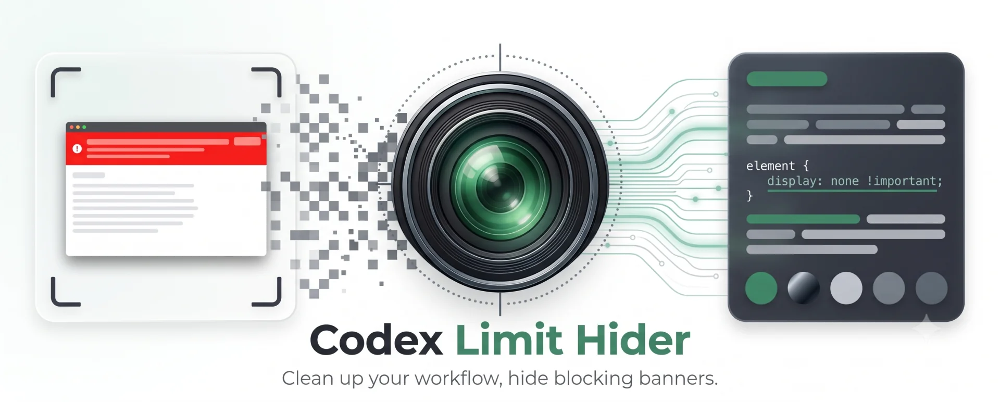

[简体中文](README.md)

An unofficial, user-level macOS customization that hides the blocking “Codex / Work usage exhausted” banner and releases its layout space.

It does **not** increase, restore, or bypass usage limits. It never clicks purchase or reset actions, edits the signed app bundle, re-signs Codex, or changes account data. The managed Codex instance listens on a **localhost-only** debug port (random port chosen by Chromium, never reachable from other machines) so the controller can perform a one-time script injection; the controller disconnects immediately after injection.

## How it works

A per-user LaunchAgent watches for a freshly launched, officially signed Codex process. It verifies the app path, bundle identifier, OpenAI Team ID, deep code signature, PID/start identity, exact main page, and a strict allowlist of banner text, structure, and actions. For the handoff it relaunches the app through Launch Services (via a tiny locally generated launcher bundle, so the app keeps its normal foreground context) with `--remote-debugging-port=0`, then connects over localhost WebSocket CDP and injects a fail-closed banner hider.

Only one uniquely qualified banner is marked and hidden. Unknown structures, actions, or multiple candidates remain visible.

The injected script never observes the full page DOM. Once per second it runs only a targeted `#root aside` query to discover new banners (paused while the window is hidden). A `MutationObserver` is attached only to an `aside` that already passes the banner's structural class prefilter, so typing and message-stream updates inside other live asides (sidebars, composers) trigger no patch callback. Relevant changes are coalesced within a 200ms window, and a new banner is normally hidden within one second.

The controller's CDP presence is ephemeral. It attaches during startup, injects and verifies the script, then stops target discovery, detaches every session, and disconnects. While you use the app there is no attached DevTools client, no periodic `Runtime.evaluate`, and no renderer polling — a persistently attached client measurably changes renderer behavior (timer throttling, back/forward cache, network stack), which showed up as input and session-switching lag in live use. If Codex reloads its page in place, the banner returns until the next app launch.

This is a community project, not an OpenAI feature and not supported by OpenAI.

## Requirements

- macOS;
- Codex installed at `/Applications/ChatGPT.app`;
- Xcode Command Line Tools (`swiftc`);
- permission to install a per-user LaunchAgent.

## Install

```zsh
git clone https://github.com/DavidLam-oss/codex-limit-banner-hider.git
cd codex-limit-banner-hider
./install.sh
```

Installation preserves the currently running Codex PID. Quit normally with `⌘Q` when no task is running, then reopen Codex. A successful active state reports `mode: managed` with `decision: absent` or `hidden`.

```zsh
./status.sh --json
```

Codex updates do not overwrite this project. Every new process is reverified. Compatible UI versions are handled automatically; incompatible DOM changes fail closed.

## Test

```zsh
./test/run.sh
```

The local integration tests use an isolated temporary profile and cover the private CDP pipe, ten target/non-target DOM cases, and three discovery/observer performance regressions. They verify final visibility, ensure input-style text and node updates (including inside a live sidebar-style aside) trigger no observer callback, discover new banners on schedule, coalesce relevant updates, and never click a banner action.

## Uninstall

```zsh
./uninstall.sh
```

Installed files are moved to Trash. A currently running Codex process is not force-quit.

See [SECURITY.md](SECURITY.md) for the security model and reporting guidance.

## License

[MIT](LICENSE)
