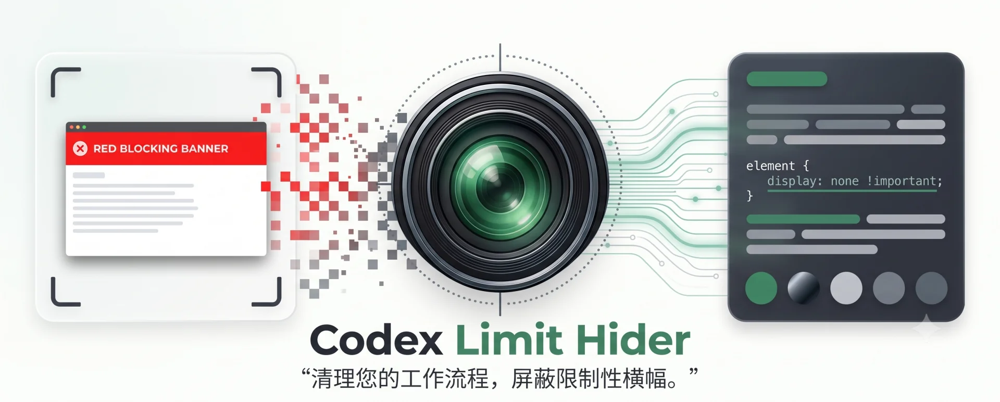

[English](README.en.md)

一个适用于 macOS Codex 桌面版的非官方、用户级界面定制：当通用 Codex / Work usage 已耗尽时，精确隐藏整块 blocking 横幅及其布局占位。

它不会增加、恢复或绕过额度，也不会：

- 点击 `Upgrade`、`Reset usage` 或任何购买／重置按钮；
- 隐藏图片生成限额、单模型限额、接近额度 warning、安全提示或错误提示；
- 修改 `/Applications/ChatGPT.app`、`app.asar`、登录资料、Keychain 或自动更新器；
- 重新签名应用。

受管 Codex 实例会监听一个**仅绑定 localhost** 的调试端口（由 Chromium 随机选取、外部机器无法访问），控制器用它完成一次性脚本注入，注入完成后立即断开连接。

> 这是社区项目，不是 OpenAI 官方功能，也不受 OpenAI 支持。

## 工作原理

```text
用户正常启动 Codex
        ↓
用户级 LaunchAgent 发现新的官方 Codex 进程
        ↓
校验应用路径、Bundle ID、OpenAI Team ID 和深层代码签名
        ↓
只对刚刚发现、尚未承载任务的新进程进行一次优雅交接
        ↓
通过 Launch Services 启动本地生成的 launcher 小程序，
由它 exec 原版 Codex 并带上 --remote-debugging-port=0
        ↓
Chromium 随机选取端口并写入 profile 的 DevToolsActivePort
        ↓
控制器通过 localhost WebSocket CDP 连接并注入
        ↓
精确验证 app://-/index.html 主页面及目标横幅结构
        ↓
只给唯一合格的横幅添加隐藏标记和 display:none
```

控制器不会删除 DOM 或点击页面元素。页面结构不确定、候选不唯一或出现未知按钮时，它会 fail closed：保留原界面并报告原因。

注入脚本不会监听整棵页面 DOM。它每秒只做一次定向的 `#root aside` 查询来发现新横幅（窗口隐藏时暂停）；只有通过横幅结构 class 预检（`w-full`/`rounded-2xl`/`bg-surface`）的 `aside` 才会挂载局部 `MutationObserver`，因此侧边栏、输入框等其它真实 `aside` 内的文字、节点更新不会触发补丁回调；相关变化在 200ms 窗口内合并核对，新横幅通常会在 1 秒内被隐藏。

控制器的 CDP 介入是短暂的：仅在启动阶段 attach、注入并确认脚本生效，随后关闭 target discovery、detach 全部会话并断开连接。日常使用期间没有常驻 DevTools client、没有周期性 `Runtime.evaluate`、不轮询 renderer——常驻 attach 会改变渲染器行为（定时器节流、后退缓存、网络栈），此前表现为输入和 Session 切换卡顿。若 Codex 页面原地 reload，横幅会重新出现，直到下次启动。

## 系统要求

- macOS；
- Codex 桌面版安装在 `/Applications/ChatGPT.app`；
- Xcode Command Line Tools（安装脚本需要 `swiftc`）；
- 当前用户可以创建用户级 `LaunchAgent`。

该项目只核对并支持当前本机可验证的官方签名 Codex。其他安装路径、重签名构建或第三方打包版本会被拒绝。

## 安装

```zsh
git clone https://github.com/DavidLam-oss/codex-limit-banner-hider.git
cd codex-limit-banner-hider
./install.sh
```

安装不会退出当前 Codex。当前 PID 会被记录并保留；首次生效需要在没有进行中任务时用 `⌘Q` 正常退出 Codex，然后重新打开。

控制器会跟踪退出期间出现的新 PID，因此快速退出／重开不会再被固定的 8 秒窗口漏掉。深层签名校验耗时也不再消耗接管资格窗口。

## 状态

```zsh
./status.sh
./status.sh --json
```

常见状态：

- `current-process-preserved`：安装时已有 Codex 在运行，等待下次正常启动；
- `waiting-for-next-launch`：控制器正在等待 Codex；
- `verifying-new-process` / `restarting-new-process`：正在安全交接刚启动的新进程；
- `absent`：受控运行正常，当前没有目标横幅；
- `hidden`：已唯一识别并隐藏目标横幅；
- `structure-rejected` / `ambiguous`：结构无法安全唯一识别，没有隐藏任何内容；
- `late-process-preserved`：控制器启动时发现了已经运行较久的普通 Codex，为保护任务而不接管；
- `external-debug-process-preserved`：检测到其他调试／隔离实例，没有接管。

判断是否已经生效，应同时看到 `mode: managed` 和 `decision: absent` 或 `hidden`。仅有 `installed: true` 不代表当前进程已经注入。

## Codex 更新后的行为

项目不修改应用包，因此 Codex 更新不会覆盖安装文件。更新后启动的新官方进程会重新接受身份、签名、主页面和 DOM 结构校验。

如果新版结构兼容，定制会自动重新应用；如果结构变化，控制器会 fail closed 并报告 `structure-rejected` 或 `ambiguous`。这比放宽选择器后误伤其他通知更安全。

## 测试

```zsh
./test/run.sh
```

测试包括：

- Swift 控制器编译；
- shell 和 JavaScript 语法检查；
- 使用隔离 `--user-data-dir` 的私有 CDP Pipe 自测（本机存在 Codex 时）；
- 10 组目标／非目标 DOM 场景，确认可见性正确且所有按钮点击数为 `0`；
- 3 组发现／Observer 性能回归，确认输入框式文字和节点更新（包括侧边栏式 `aside` 内的流式更新）触发 `0` 次 Observer 回调，新横幅可被定时发现，相关连续更新被合并为不超过 2 次。

DOM 用例覆盖目标横幅、截图文案、图片限额、模型限额、接近额度 warning、安全提示、错误文本、未知按钮和多个候选。

## 卸载

```zsh
./uninstall.sh
```

项目文件和 LaunchAgent 会移动到废纸篓，可恢复。当前正在运行的 Codex 不会被强制退出；正常退出后再次启动时，定制不会回来。

## 安全边界

每次接管新进程前都会核对：

1. 固定应用路径和 Bundle ID `com.openai.codex`；
2. OpenAI Team ID `2DC432GLL2` 的有效深层签名；
3. PID 和进程启动身份在签名校验前后保持一致；
4. 唯一主页面 target `app://-/index.html`；
5. 页面标题、`#root` 和主窗口专用 toolbar 标记；
6. 唯一 blocking 标题、已知正文模板、`aside` 结构、SVG 和允许按钮集合。

内部 DOM 不是公开稳定 API。不要把当前 class 或文案模板视为永久接口；升级后应以 fail-closed 状态和新的隔离测试为准。

安全问题请参阅 [SECURITY.md](SECURITY.md)。

## License

[MIT](LICENSE)
